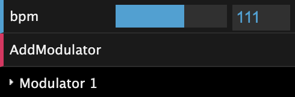
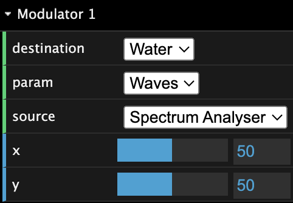

# [music-visualizer-vr][pages-url]

[![GitHub deployments][pages]][pages-url]
[![License: MIT][license]][license-url]

customizable music visualizer with vr support

## Starting the Visualizer

 Start playing default song - [52nd Street](https://yewtu.be/watch?v=OIFASfPkw9g)

 Upload your own music to play

 Use your microphone as the audio source

### VR

To enter VR mode, click the Enter VR button on the bottom of the viewport.

## Using the Controls

> [!NOTE]
> The controls are hidden when entering WebXR mode.

- **bpm**: beats per minute (sets period of oscillation for generated sources)
- **AddModulator**: creates and adds a new modulator

## Customizing the Modulators

Each modulator is made up of a source and a destination. The source is the trigger for the modulation. The destination is the visual effect that is being modified by the source.

### Sources

There are 2 types of sources, generated and audio.

#### Generated

Generated sources are generated by the application. They are only affected by the bpm.

- **Sine**: The sine is a generated sine wave.
- **Triangle**: The triangle is a generated triangle wave.
- **Square**: The square is a generated square wave.
- **Sawtooth**: The sawtooth is a generated sawtooth wave.

#### Audio

Audio sources are generated by the audio input. And parsed with `THREE.AudioAnalyser`.

- **Spectrum Analyzer**: The spectrum analyzer is a visual representation of the audio frequencies.
    - For all objects except for water, the spectrum analyzer acts as volume.
- **Bass**: The bass is the lowest frequency audio.
- **Treble**: The treble is the less-low frequency audio.
- **Mid**: The mid is the mid frequency audio.
- **High**: The high is the high frequency audio.

### Destinations

The destinations each have their own parameters that can be modified by the source.

| Destination    | Parameters                 |
|----------------|----------------------------|
| **Water**      | Waves                      |
| **Light#**     | Intensity, Hue, Saturation |
| **Modulator#** | x, y                       |

### Parameters

Each parameter responds differently to x and y controls of the modulator, the mappings are as follows.

| Parameter      | x                  | y          |
|----------------|--------------------|------------|
| **Waves**      | distance           | height     |
| **Intensity**  | reactivity (scale) | intensity  |
| **Hue**        | rate of change     | hue        |
| **Saturation** | rate of change     | saturation |
| **x**          | reactivity (scale) | actual x   |
| **y**          | reactivity (scale) | actual y   |

## References

- [THREE.js audio visualizer](https://github.com/mrdoob/three.js/blob/master/examples/webaudio_visualizer.html)
- [THREE.js webgl shaders ocean](https://github.com/mrdoob/three.js/blob/master/examples/webgl_shaders_ocean.html)
- [THREE.js audio visualiser by santosharron](https://github.com/santosharron/audio-visualizer-three-js)
- [simplex-noise.js](https://29a.ch/simplex-noise/docs/index.html#400)
- [THREE.js webgl shadowmap pointlight](https://github.com/mrdoob/three.js/blob/master/examples/webgl_shadowmap_pointlight.html)
- [Meduim: How to create a sphere texture with Blender](https://medium.com/geekculture/how-to-create-textures-for-three-js-spheregeometry-using-blender-d20a907b5b47)
- ChatGPT
- UMass Boston CS460!

[pages]: https://img.shields.io/github/deployments/ethab83/music-visualizer-vr/github-pages
[pages-url]: https://ethab83.github.io/music-visualizer-vr/
[license]: https://img.shields.io/badge/License-MIT-yellow.svg
[license-url]: https://opensource.org/licenses/MIT
